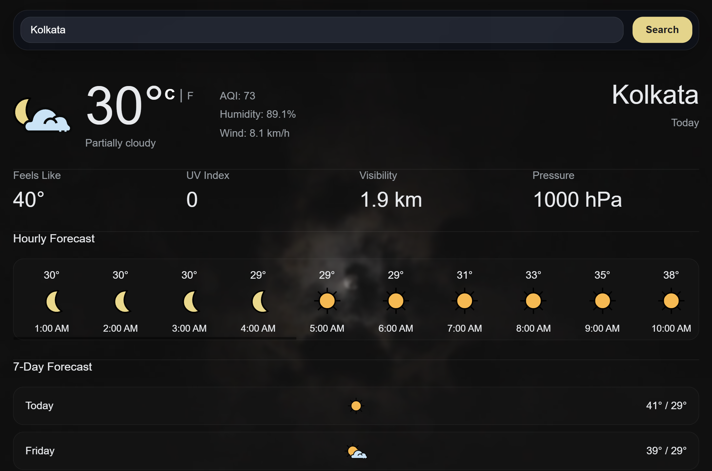
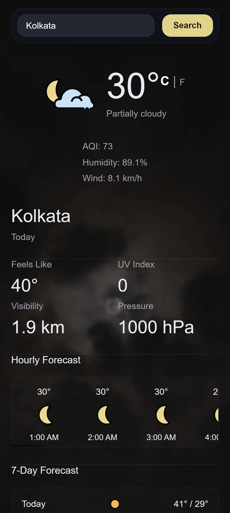

# 🌦️ Weather App

A modern and immersive weather application built with **HTML, CSS, JavaScript, and Webpack** that delivers real-time weather information with dynamic video backgrounds, responsive UI, AQI tracking, hourly forecasts, and weekly forecasts.

This project was developed while learning from **The Odin Project**, but expanded far beyond the original assignment with custom UI design, animated backgrounds, weather-based visuals, geolocation support, AQI integration, and advanced frontend structuring.

---

## 📸 Preview

| Desktop Version | Mobile Version |
|---|---|
|  |  |
---

## ✨ Features

- 🌍 Real-time weather data
- 🔎 Search weather by city name
- 📍 Automatic geolocation-based weather
- 🌡️ Celsius / Fahrenheit switching
- 🕒 24-hour forecast system
- 📅 7-day weather forecast
- 🌫️ AQI (Air Quality Index)
- 🌅 Sunrise & Sunset timings
- 🎥 Dynamic weather video backgrounds
- 🎨 Glassmorphism-inspired modern UI
- 📱 Fully responsive design
- ⚡ Fast loading experience
- ❄️ Weather-specific animated visuals
- 🌙 Day/Night weather handling

---

# 🧠 Tech Stack

- HTML5
- CSS3
- JavaScript (ES6 Modules)
- Webpack
- Date-fns
- Visual Crossing Weather API
- Open-Meteo AQI API
- OpenStreetMap Nominatim API

---

# 📂 Project Structure

```bash
weather-app/
│
├── src/
│   ├── assets/
│   │   ├── icons/
│   │   └── videos/
│   │
│   ├── api.js
│   ├── dom.js
│   ├── forecast.js
│   ├── index.js
│   ├── loading.js
│   ├── location.js
│   ├── style.css
│   ├── template.html
│   └── utils.js
│
├── app_screenshots/
├── package.json
├── package-lock.json
├── webpack.common.js
├── webpack.dev.js
├── webpack.prod.js
└── README.md
```

---

# ⚙️ Core Functionality

## Weather Fetching

The app fetches weather data from the Visual Crossing Weather API using async JavaScript and dynamically updates the UI.

## AQI Integration

Air Quality Index data is fetched separately using the Open-Meteo AQI API.

## Dynamic Background Videos

Background videos automatically change depending on weather conditions like rain, snow, thunderstorms, fog, clear skies, etc.

## Hourly & Weekly Forecasts

The app dynamically renders:

- Hourly forecasts
- Weekly forecast cards
- Weather icons
- Temperature conversion
- Time formatting

using modular rendering functions.

## Responsive UI

The application includes responsive layouts optimized for mobile devices using CSS media queries and flexible layouts.

---

# 🎨 UI Highlights

- Glassmorphism search section
- Blurred overlays
- Dynamic fullscreen weather videos
- Thin custom scrollbars
- Smooth hover animations
- Minimal modern weather dashboard
- Mobile responsive forecast cards

---

# 📚 What I Learned

This project helped strengthen my understanding of:

- Working with APIs using `fetch()`
- Async / Await
- Error handling
- DOM manipulation
- ES6 modules
- Webpack asset management
- Responsive web design
- Dynamic rendering
- Geolocation APIs
- Modular frontend architecture
- UI/UX improvements
- Performance optimization for media-heavy interfaces

---

# 🌐 APIs Used

## Weather Data

- [Visual Crossing Weather API](https://www.visualcrossing.com/weather-api)

## Air Quality Data

- [Open-Meteo Air Quality API](https://open-meteo.com/en/docs/air-quality-api)

## Reverse Geocoding

- [OpenStreetMap Nominatim API](https://nominatim.org/)

---

# 🎨 Assets & Credits

## Weather Icons

Weather icons sourced from:

- [visualcrossing/weather-icons Repository](https://github.com/visualcrossing/WeatherIcons)

## Background Videos

Weather background videos sourced from:

- [Pexels Videos](https://www.pexels.com/videos/)

---

# 🚀 Installation

Clone the repository:

```bash
git clone https://github.com/your-username/weather-app.git
```

Move into the project directory:

```bash
cd weather-app
```

Install dependencies:

```bash
npm install
```

Start development server:

```bash
npm run dev
```

Build production version:

```bash
npm run build
```

---

# ⚠️ Challenges Faced

- Handling negative temperature edge cases
- Dynamic video switching based on API conditions
- Mobile responsiveness issues
- Forecast rendering synchronization
- Managing large video assets efficiently
- Weather icon mapping
- API error handling
- Keeping UI smooth with heavy background media

---

# 🔮 Future Improvements

- Weather alerts & warnings
- PWA support
- Offline caching
- Search history
- Favorite locations
- Better AQI visualization
- Radar maps
- Multi-language support
- Animated transitions between weather states
- Better loading skeletons

---

# 🙌 Acknowledgements

- [The Odin Project](https://www.theodinproject.com/)
- [Visual Crossing](https://www.visualcrossing.com/)
- [Open-Meteo](https://open-meteo.com/)
- [OpenStreetMap](https://www.openstreetmap.org/)
- [Pexels](https://www.pexels.com/)

---

# 📄 License

This project is created for educational and portfolio purposes.